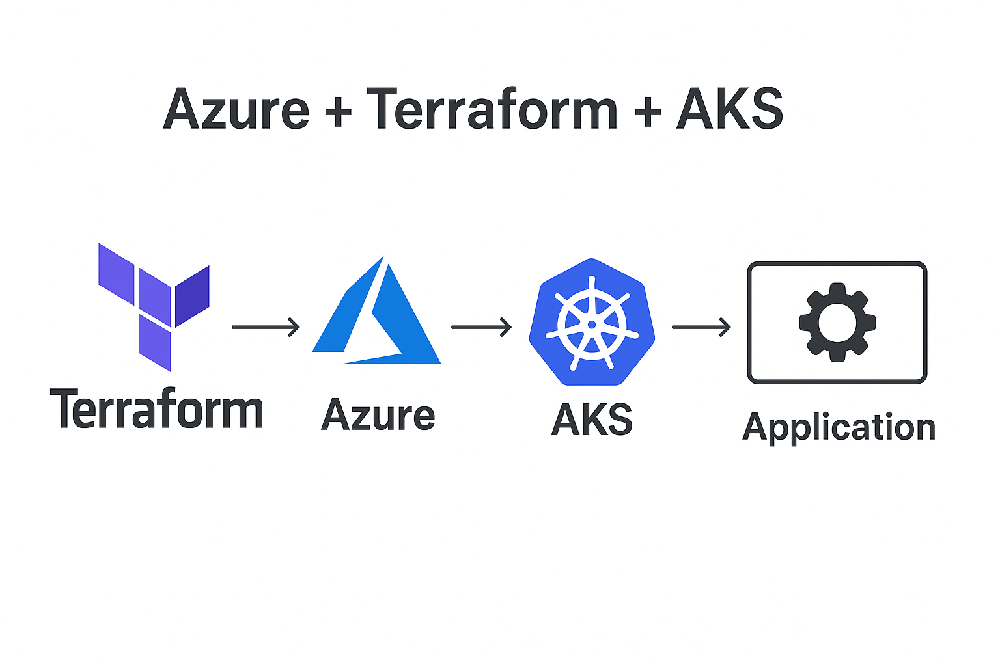

# Azure + Terraform + AKS Hands-on Lab

This project demonstrates how to provision an **Azure Kubernetes Service (AKS)** cluster using **Terraform**, and then deploy a sample Nginx application using **kubectl**.

It is designed as a hands-on lab for learning the fundamentals of **Infrastructure as Code (IaC)** and container orchestration with **Azure Kubernetes Service**.

---

## 🚀 Architecture



- **Terraform** – Manages infrastructure as code.
- **Azure** – Cloud platform hosting the AKS cluster.
- **AKS (Azure Kubernetes Service)** – Kubernetes cluster running in Azure.
- **Application (Nginx)** – Deployed to AKS as a test workload.


---

## ✅ Prerequisites

- [Azure CLI](https://learn.microsoft.com/en-us/cli/azure/install-azure-cli)  
- [Terraform](https://developer.hashicorp.com/terraform/downloads)  
- [kubectl](https://kubernetes.io/docs/tasks/tools/)  

### Install kubectl (Linux example)
```bash
# Using snap (quickest)
sudo snap install kubectl --classic

# Or download binary directly
curl -LO "https://dl.k8s.io/release/$(curl -s https://dl.k8s.io/release/stable.txt)/bin/linux/amd64/kubectl"
chmod +x kubectl
sudo mv kubectl /usr/local/bin/

Verify:

kubectl version --client

Authenticate with Azure

az login
az account set --subscription "<YOUR_SUBSCRIPTION_ID>"

⚡ Usage
1. Deploy Infrastructure

cd terraform
terraform init
terraform plan
terraform apply -auto-approve

2. Configure kubectl

az aks get-credentials --resource-group rg-aks-lab --name aks-lab-cluster
kubectl get nodes

Expected output:

NAME                                STATUS   ROLES   AGE   VERSION
aks-nodepool1-xxxxx                 Ready    agent   1m    v1.29.x

3. Deploy Sample Application

kubectl apply -f ../k8s/nginx.yaml
kubectl get svc nginx-service

When EXTERNAL-IP appears, open it in a browser → you should see the Nginx welcome page 🎉.

🧹 Cleanup

When finished, destroy all resources:

📖 Learning Objectives

By completing this lab, you will:

Learn how to use Terraform to provision AKS clusters on Azure.

Understand how kubectl interacts with Kubernetes clusters.

Deploy a basic containerized application to AKS.

Manage infrastructure lifecycle (provision → deploy → destroy).

